# Rapport Technique — Water Quality Pipeline

**Réalisé par** : Kaouter Rhazlani  
**Formation** : Simplon — P1 / Data Engineer  
**Date** : Mai 2026  
**Source** : [Hub'Eau — Qualité Eau Potable](https://hubeau.eaufrance.fr/page/api-qualite-eau-potable)  
**Stack** : PySpark · Delta Lake · Azure ADLS Gen2 · Databricks · GitHub Actions CI/CD

---

## Table des matières

1. [Contexte et valeur métier](#1-contexte-et-valeur-métier)
2. [Parcours technique : du local à Databricks](#2-parcours-technique--du-local-à-databricks)
3. [Architecture générale](#3-architecture-générale)
4. [Infrastructure Azure](#4-infrastructure-azure)
5. [Blocages Azure rencontrés et solutions](#5-blocages-azure-rencontrés-et-solutions)
6. [Couche Bronze — Ingestion](#6-couche-bronze--ingestion)
7. [Couche Silver — Transformation](#7-couche-silver--transformation)
8. [Couche Gold — Tables analytiques](#8-couche-gold--tables-analytiques)
9. [Couche Quality — Validation Great Expectations](#9-couche-quality--validation-great-expectations)
10. [API FastAPI — Databricks Apps](#10-api-fastapi--databricks-apps)
11. [Dashboard — Databricks SQL](#11-dashboard--databricks-sql)
12. [Orchestration — Databricks Workflow](#12-orchestration--databricks-workflow)
13. [CI/CD — GitHub Actions](#13-cicd--github-actions)
14. [Tests et validation](#14-tests-et-validation)
15. [Structure du projet](#15-structure-du-projet)
16. [Données clés](#16-données-clés)
17. [Limitations et axes d'amélioration](#17-limitations-et-axes-damélioration)
18. [Synthèse](#18-synthèse)

---

## 1. Contexte et valeur métier

L'eau du robinet est l'aliment le plus contrôlé en France : plus de **300 000 prélèvements** et **12 millions d'analyses** par an depuis 1994, gérés dans la base nationale SISE-Eaux par le Ministère des Solidarités et de la Santé.

Ce pipeline transforme ces données brutes en intelligence exploitable :

| Besoin métier | Réponse apportée |
|---|---|
| Suivre la conformité sanitaire par territoire | Table `gold_conformite_dept` agrégée par année × département |
| Identifier les paramètres à risque | Table `gold_parametres_risks` — top 10 non-conformités |
| Cartographier la qualité par commune | Table `gold_commune_stats` avec géocodage lat/lon |
| Détecter les tendances temporelles | Table `gold_evolution_mensuelle` avec delta mois/mois |

---

## 2. Parcours technique : du local à Databricks

### 2.1 Permissions Azure bloquantes dès le début

Le projet a démarré avec l'intention de travailler directement sur Databricks. La subscription Azure de formation imposait cependant des restrictions qui ont rendu cela impossible dans un premier temps :

- **Création de workspace Databricks bloquée** : le rôle `Contributor` sur la subscription n'était pas disponible.
- **Création d'un storage account bloquée** : mêmes restrictions de permissions pour la création de ressources Azure.

**Conséquence** : tout le développement initial s'est fait en **environnement local**, avec PySpark standalone en mode `local[*]`, en attendant que l'équipe de formation provisionne les ressources Azure.

### 2.2 PySpark en local : contraintes machine

Travailler avec PySpark en local signifie que la JVM, le driver Spark et les executors tournent tous sur la **même machine**. Sur un poste de développement standard, cela génère des problèmes sérieux dès que les volumes de données augmentent :

| Problème rencontré | Cause | Impact |
|---|---|---|
| **Crash mémoire OutOfMemoryError** | JVM Spark consomme 4-8 GB RAM en mode local | Plantage de la session Spark |
| **Freeze machine** | JVM + VS Code + navigateur saturent la RAM disponible | Perte de travail, redémarrage forcé |
| **Temps d'exécution longs** | Pas de parallélisme réel en `local[*]` | 10-15 min pour ingérer 757k lignes |
| **Pauses Garbage Collector JVM** | Longues pauses GC sur gros DataFrames | Timeouts sur les transformations Silver |

Des ajustements de configuration ont permis de stabiliser l'environnement local :

```python
spark = SparkSession.builder \
    .master("local[*]") \
    .config("spark.driver.memory", "4g") \
    .config("spark.sql.shuffle.partitions", "8") \
    .config("spark.sql.extensions", "io.delta.sql.DeltaSparkSessionExtension") \
    .config("spark.sql.catalog.spark_catalog", "org.apache.spark.sql.delta.catalog.DeltaCatalog") \
    .getOrCreate()
```

### 2.3 Implémentation initiale avec la bibliothèque DLT

Le pipeline a d'abord été développé en s'appuyant sur la bibliothèque `dlt` (package PyPI `dlt[deltalake]`). Cette approche fonctionnait correctement en local :

```python
import dlt  # package Python dlt[deltalake] — fonctionne en local

@dlt.table(name="water_quality")
def bronze_water_quality():
    return spark.read.json(...)
```

Les tests unitaires passaient, les tables Delta étaient produites comme attendu, les transformations Silver et Gold s'exécutaient correctement.

### 2.4 Conflit d'import sur Databricks : DLT local ≠ DLT Databricks

Lors du premier déploiement sur Databricks, un conflit d'import critique a été découvert :

```
ImportError: cannot import name 'table' from 'dlt'
```

**Cause** : sur Databricks, `import dlt` ne résout **pas** vers le package PyPI `dlt[deltalake]` — il résout vers le module natif **Delta Live Tables** de Databricks, un moteur d'orchestration déclaratif avec une API entièrement différente. Les deux bibliothèques portent le même nom de module `dlt` mais sont fondamentalement incompatibles.

| Contexte | `import dlt` résout vers | Résultat |
|---|---|---|
| Local (PySpark standalone) | Package `dlt[deltalake]` (PyPI) | ✅ Fonctionne |
| Databricks | Module Delta Live Tables natif | ❌ `ImportError` |

### 2.5 Solution finale : PySpark natif + Delta Lake direct

Pour contourner ce conflit de façon propre et pérenne, le pipeline a été entièrement réécrit en **PySpark natif avec Delta Lake direct**, sans aucune dépendance au module `dlt`. Cette réécriture a également permis d'implémenter le **dual-write** Unity Catalog + ADLS Gen2 :

```python
# 1. Unity Catalog (table managée)
sdf.write.format("delta").mode("overwrite") \
    .saveAsTable("databricks_waterquality.bronze.water_quality")

# 2. ADLS Gen2 (authentification par clé Databricks Secrets)
sdf.write.format("delta").mode("overwrite") \
    .option("fs.azure.account.key.sawaterquality.dfs.core.windows.net", storage_key) \
    .save("abfss://bronze@sawaterquality.dfs.core.windows.net/water_quality/")
```

**Bilan du parcours** :

| Étape | Environnement | Outil | Résultat |
|---|---|---|---|
| Phase 1 | Local PySpark | `dlt[deltalake]` | ✅ Fonctionne, mais crashes mémoire |
| Phase 2 | Databricks | `dlt[deltalake]` | ❌ Conflit import DLT natif |
| Phase 3 | Local + Databricks | PySpark natif + Delta | ✅ Compatible partout, stable |

---

## 3. Architecture générale

### 3.1 Architecture médaillon

Le pipeline suit l'architecture médaillon en cinq couches, orchestrée par un **Databricks Workflow** hebdomadaire :


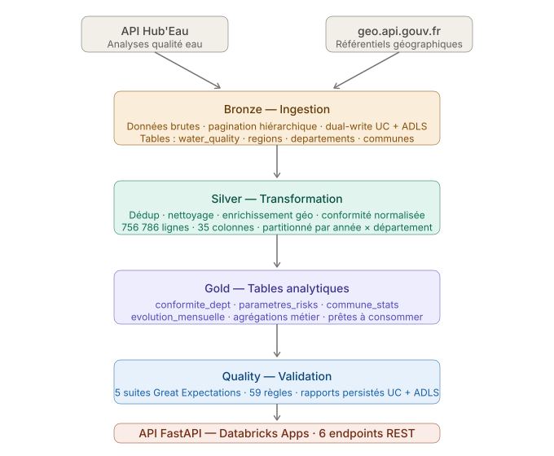


### 3.2 Stockage dual : Unity Catalog + ADLS Gen2

Chaque notebook écrit simultanément dans deux destinations complémentaires :

| Destination | Usage |
|---|---|
| **Unity Catalog** | Tables managées, gouvernance des données, lineage |
| **ADLS Gen2** | Persistance Delta native, partitionnement physique par couche |

Cette stratégie dual-write garantit la résilience : si l'une des destinations est temporairement indisponible, les données restent accessibles via l'autre.

#### Tentative préalable : External Location + Storage Credential dans Unity Catalog

Avant d'adopter le dual-write par clé, une approche plus native avait été tentée : configurer un **External Location** dans Unity Catalog pointant directement vers le storage account ADLS Gen2, via une **Storage Credential** basée sur l'Access Connector.

L'idée était de créer une liaison officielle entre Unity Catalog et le storage pour que Spark puisse écrire via `abfss://` sans passer une clé manuellement. Les étapes tentées dans l'UI Databricks :

**Étape 1 — Créer une Storage Credential**

Dans **Catalog → External Data → Credentials → Add credential** :
- Type : Azure Managed Identity
- Nom : `waterquality_credential`
- Access Connector ID : chemin de la ressource `unity-catalog-access-connector`

**Étape 2 — Créer un External Location**

Dans **Catalog → External Data → External Locations → Add external location** :
- URL : `abfss://bronze@sawaterquality.dfs.core.windows.net`
- Storage credential : `waterquality_credential`
- Cliquer **Test connection** pour valider l'accès

**Résultat** : cette approche a échoué — l'Access Connector ne dispose pas de la permission nécessaire sur le storage account. Sans ce droit, Unity Catalog ne peut ni valider la credential ni créer l'External Location. Ce blocage est documenté en section 5.

---

## 4. Infrastructure Azure

Le projet repose sur trois ressources Azure déployées dans le même Resource Group.

### 4.1 Resource Group — Vue d'ensemble

```
Resource Group : krhazlaniRG
Location       : France Central / West Europe
```

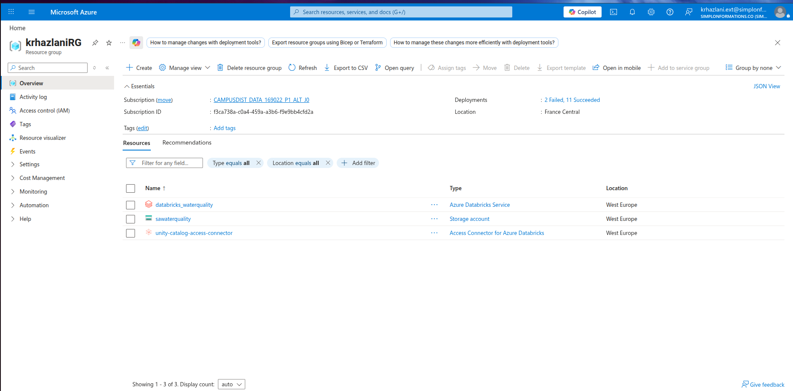

| Ressource | Type | Rôle |
|---|---|---|
| `databricks_waterquality` | Azure Databricks Service | Workspace de traitement des données |
| `sawaterquality` | Storage account (ADLS Gen2) | Stockage des données Delta Lake |
| `unity-catalog-access-connector` | Access Connector for Azure Databricks | Pont d'authentification Databricks ↔ storage |

L'**Access Connector** est l'élément clé : c'est lui qui porte l'identité managée de Databricks et qui doit recevoir la permission d'accès au storage pour que Unity Catalog puisse lire et écrire dans ADLS Gen2. Sans cette permission, le canal natif entre Databricks et le storage est bloqué — c'est le blocage principal documenté en section 5.

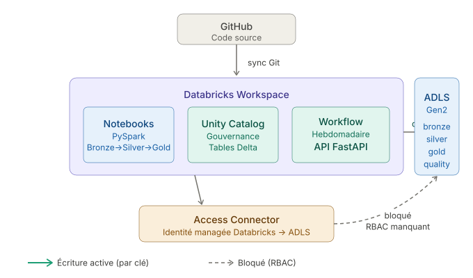

### 4.2 Storage Account ADLS Gen2 — sawaterquality

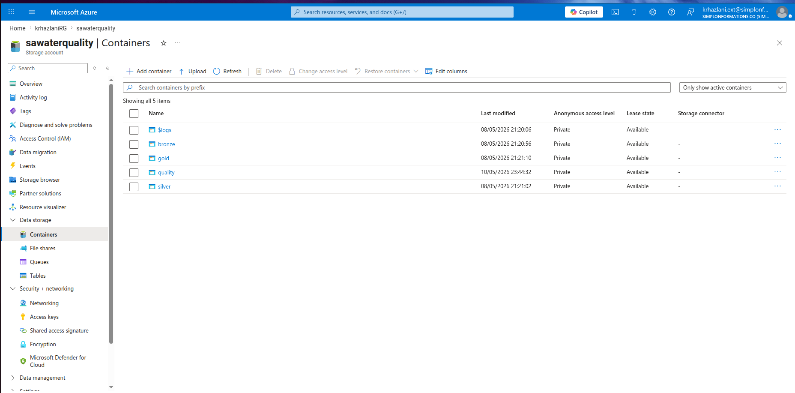

| Container | Rôle |
|---|---|
| `bronze` | Données brutes ingérées depuis Hub'Eau et geo API |
| `silver` | Données nettoyées et enrichies |
| `gold` | Tables analytiques agrégées |
| `quality` | Rapports Great Expectations |

L'accès se fait via la **clé du compte**, stockée dans Databricks Secrets (scope `waterquality`) :

```python
storage_key = dbutils.secrets.get(scope="waterquality", key="storage-account-key")
```

### 4.3 Workspace Databricks — databricks_waterquality

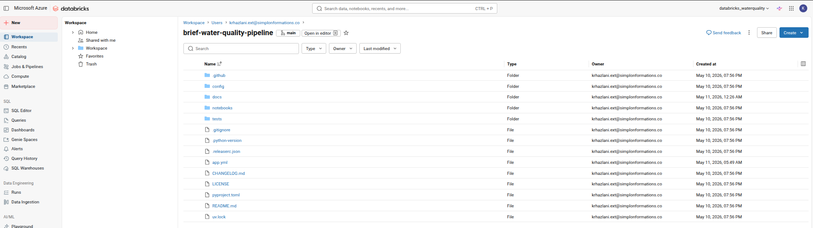

Le workspace contient tous les notebooks, le Workflow, l'API Databricks Apps et le dashboard SQL. Le repo GitHub est synchronisé directement via l'intégration Git de Databricks.

### 4.4 Unity Catalog

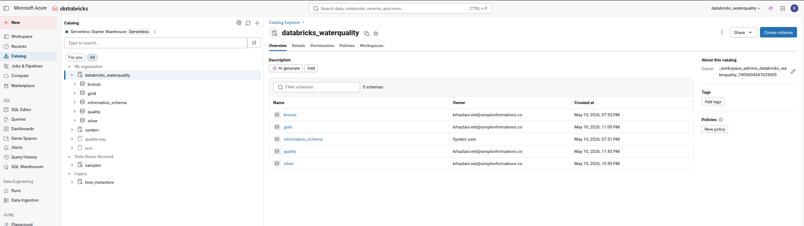

```
databricks_waterquality
├── bronze    water_quality · regions · departements · communes
├── silver    water_quality  (35 colonnes)
├── gold      gold_conformite_dept · gold_parametres_risks · gold_commune_stats · gold_evolution_mensuelle
└── quality   quality_reports
```

### 4.5 Compute — Serverless

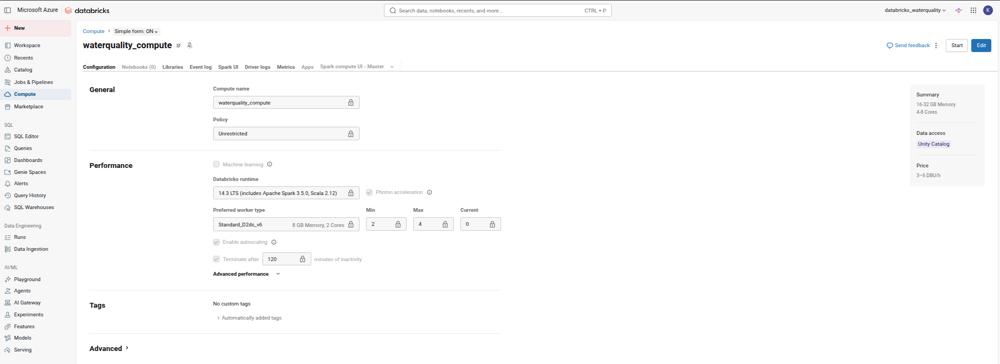

```
Runtime : Databricks 14.3 LTS (Apache Spark 3.5.0, Scala 2.12)
Workers : Standard_D2ds_v6 — 8 GB Memory, 2 Cores (autoscaling 2-4)
Prix    : 3-6 DBU/h
```

---

## 5. Blocages Azure rencontrés et solutions

### 5.1 Contexte

La subscription Azure de formation impose des restrictions sur les permissions qui ont impacté plusieurs aspects de l'intégration cloud.

### 5.2 Blocage principal : RBAC insuffisant sur le storage

Pour que Databricks accède à ADLS Gen2 via Unity Catalog, l'Access Connector doit disposer du rôle `Storage Blob Data Contributor` sur le storage account. Ce droit nécessite le rôle **Owner** ou **User Access Administrator** sur la subscription — non disponible sur le compte de formation.

**Erreur obtenue** :

```
PERMISSION_DENIED: Request for user delegation key is not authorized. SQLSTATE: 42501
```

**Commande à exécuter par un administrateur pour débloquer** :

```bash
az role assignment create \
  --assignee "04466fd6-bcb0-478c-b257-89823dd8300f" \
  --role "Storage Blob Data Contributor" \
  --scope "/subscriptions/f3ca738a-c0a4-459a-a3b6-f9e9bb4cfd2a/resourceGroups/krhazlaniRG/providers/Microsoft.Storage/storageAccounts/sawaterquality"
```

**Solution mise en place** : dual-write via la clé du storage account, stockée dans Databricks Secrets. Ce pattern contourne le mécanisme de délégation Unity Catalog et fonctionne sans role assignment RBAC.

### 5.3 Méthodes de configuration bloquées sur Serverless

| Méthode | Erreur | Raison |
|---|---|---|
| `spark.conf.set("fs.azure.sas.*")` | `CONFIG_NOT_AVAILABLE` | Bloqué par Unity Catalog |
| `sc._jsc.hadoopConfiguration()` | `NotImplementedError` | Non supporté Serverless |
| `dbutils.fs.mount()` | `Method not whitelisted` | Désactivé avec UC |

**Solution** : passer les credentials directement en `.option()` sur le writer Spark.

---

## 6. Couche Bronze — Ingestion

La couche Bronze est la première couche du pipeline. Elle ingère les données **telles quelles** depuis les sources externes, sans transformation métier. Son rôle est de capturer et persister les données brutes.

### 6.1 Sources ingérées

Deux notebooks s'exécutent **en parallèle** dans le Workflow :

| Notebook | Source | Tables produites |
|---|---|---|
| `bronze_ingest_hubeau.py` | API Hub'Eau | `bronze.water_quality` |
| `bronze_ingest_geo.py` | API geo.api.gouv.fr | `bronze.regions`, `bronze.departements`, `bronze.communes` |

### 6.2 Ingestion Hub'Eau (`bronze_ingest_hubeau.py`)

L'API Hub'Eau est l'API nationale de qualité de l'eau potable. Elle expose les résultats d'analyses du ministère via des endpoints JSON paginés.

**Endpoint utilisé** :

```
GET https://hubeau.eaufrance.fr/api/v1/qualite_eau_potable/resultats_dis
Paramètres : code_departement, date_min_prelevement, date_max_prelevement, size, page
Limite      : 20 000 enregistrements par appel
```

**Stratégie de pagination hiérarchique** : l'API étant limitée à 20 000 résultats par requête, le notebook décompose les requêtes en plusieurs niveaux si le volume dépasse la limite :

```
Année
  └─ Trimestre (si > 20 000)
       └─ Mois (si > 20 000)
            └─ Semaine (si > 20 000)
```

**Parallélisation** : toutes les combinaisons `(département × année)` sont soumises en parallèle via `ThreadPoolExecutor` pour accélérer l'ingestion :

```python
with ThreadPoolExecutor(max_workers=MAX_WORKERS) as executor:
    futures = {
        executor.submit(fetch_year, dept, year): (dept, year)
        for dept, year in tasks
    }
```

**Écriture** : dual-write Unity Catalog + ADLS Gen2, partitionné par `annee_partition`.

### 6.3 Ingestion géographique (`bronze_ingest_geo.py`)

L'API geo.api.gouv.fr fournit les référentiels géographiques officiels français.

**Endpoints utilisés** :

```
GET https://geo.api.gouv.fr/regions       → codes et noms des régions
GET https://geo.api.gouv.fr/departements  → codes, noms, région de rattachement
GET https://geo.api.gouv.fr/communes      → codes INSEE, coordonnées GPS, population
```

Ces tables sont utilisées en Silver pour enrichir les analyses avec les données géographiques (latitude, longitude, nom de région, population).

### 6.4 Tables produites en Bronze

| Table | Lignes | Partitionnement |
|---|---|---|
| `bronze.water_quality` | ~757 000 | `annee_partition` |
| `bronze.regions` | ~18 | — |
| `bronze.departements` | ~100 | — |
| `bronze.communes` | ~35 000 | — |

---

## 7. Couche Silver — Transformation

La couche Silver transforme les données brutes Bronze en données propres, enrichies et standardisées, prêtes pour l'analyse. Elle produit une seule table : `silver.water_quality` avec **35 colonnes**.

### 7.1 Nettoyage

- **Déduplication** sur la clé métier `(code_prelevement, code_parametre, code_lieu_analyse)`
- **Filtres qualité** : suppression des lignes où `date_prelevement`, `code_commune` ou `libelle_parametre` est nul
- **Typage** : `annee_partition` → `IntegerType`, `resultat_numerique` → `DoubleType`, `date_prelevement` → `DateType`
- **Colonnes dérivées** : `annee` et `mois` extraits de `date_prelevement`
- **Suppression** des colonnes techniques DLT (`_dlt_load_id`, `_dlt_id`)

### 7.2 Standardisation

- Extraction de `code_reseau` et `nom_reseau` depuis le champ JSON `reseaux`
- Trim et mise en majuscule des libellés texte
- Padding des codes INSEE : commune sur 5 chiffres, département sur 2 chiffres
- Renommage sémantique des colonnes conformité SISE-Eaux

### 7.3 Enrichissement géographique

Jointure avec les tables de référence Bronze pour ajouter les données géographiques :

```
water_quality LEFT JOIN communes   ON code_commune
communes      LEFT JOIN regions    ON code_region
```

Colonnes ajoutées : `latitude`, `longitude`, `population`, `nom_departement`, `nom_region`

### 7.4 Catégorisation des paramètres

Les paramètres d'analyse sont classifiés à partir du `code_type_parametre` (piloté par `config.yaml`) :

| Code | `categorie_parametre` |
|---|---|
| `B` | Microbiologique |
| `P` | Physico-chimique |
| `N` | Physicochimique |
| `O` | Organoleptique |
| `R` | Radiologique |

Une `sous_categorie_parametre` est également dérivée par matching sur le libellé : nitrates, pesticides, métaux lourds, bactériologique, désinfection, radiologique.

### 7.5 Conformité normalisée

La valeur brute SISE-Eaux est normalisée en une colonne standardisée :

| Valeur SISE-Eaux | `conformite_standard` | `est_conforme` |
|---|---|---|
| "...conforme aux exigences..." | `conforme` | `True` |
| "...non-conforme..." | `non_conforme` | `False` |
| "...conforme avec remarque..." | `conforme_avec_remarque` | `null` |
| Autre / vide | `inconnu` | `null` |

### 7.6 Résultat Silver

| Métrique | Valeur |
|---|---|
| Lignes avant déduplication | ~757 000 |
| Lignes après nettoyage | ~756 786 |
| Colonnes finales | 35 |
| Partitionnement | `annee` × `code_departement` |

---

## 8. Couche Gold — Tables analytiques

La couche Gold agrège les données Silver en 4 tables analytiques directement exploitables pour le dashboard et l'API. Chaque table répond à un besoin métier précis.

### 8.1 `gold_conformite_dept`

**Besoin** : suivre le taux de conformité de l'eau potable par département et par année.

**Agrégation** : par `(annee, code_departement)`

**Colonnes clés** :

| Colonne | Description |
|---|---|
| `nb_analyses` | Nombre total d'analyses effectuées |
| `nb_conformes` | Nombre d'analyses conformes |
| `nb_non_conformes` | Nombre d'analyses non conformes |
| `taux_conformite_pct` | Pourcentage de conformité (0-100) |
| `taux_non_conformite_pct` | Pourcentage de non-conformité (0-100) |

### 8.2 `gold_parametres_risks`

**Besoin** : identifier les paramètres les plus problématiques par territoire.

**Agrégation** : top 10 paramètres non conformes par `(annee, code_departement)` via window function `RANK()`.

**Colonnes clés** :

| Colonne | Description |
|---|---|
| `libelle_parametre` | Nom du paramètre analysé |
| `categorie_parametre` | Catégorie (Microbiologique, Physicochimique...) |
| `nb_non_conformes` | Nombre de non-conformités |
| `pct_non_conformes` | Pourcentage de non-conformité (0-100) |
| `rank` | Classement dans le top 10 (1 = le plus problématique) |

### 8.3 `gold_commune_stats`

**Besoin** : cartographier la qualité de l'eau par commune avec coordonnées GPS.

**Agrégation** : par `(annee, code_commune)`

**Colonnes clés** :

| Colonne | Description |
|---|---|
| `taux_conformite_pct` | Taux de conformité de la commune |
| `nb_parametres_distincts` | Variété des paramètres analysés |
| `latitude` / `longitude` | Coordonnées GPS pour cartographie |
| `population` | Population de la commune |

### 8.4 `gold_evolution_mensuelle`

**Besoin** : détecter les tendances et dégradations dans le temps.

**Agrégation** : par `(annee, mois, code_departement)` avec calcul de tendance via `LAG()`.

**Colonnes clés** :

| Colonne | Description |
|---|---|
| `taux_conformite_pct` | Taux du mois |
| `delta_taux_pct` | Variation par rapport au mois précédent (positif = amélioration) |
| `nb_analyses` | Volume d'analyses du mois |

---

## 9. Couche Quality — Validation Great Expectations

### 9.1 Rôle

La couche Quality valide automatiquement la qualité des données après chaque run du pipeline. Elle s'exécute après Gold et génère des rapports persistés.

### 9.2 Organisation des suites

5 suites de validation couvrent Silver et les 4 tables Gold :

| Suite | Table validée | Nb règles |
|---|---|---|
| `silver_water_quality` | Silver `water_quality` | 15 |
| `gold_conformite_dept` | Gold `gold_conformite_dept` | 12 |
| `gold_parametres_risks` | Gold `gold_parametres_risks` | 10 |
| `gold_commune_stats` | Gold `gold_commune_stats` | 12 |
| `gold_evolution_mensuelle` | Gold `gold_evolution_mensuelle` | 10 |

### 9.3 Exemples de règles par couche

**Silver** :
- Colonnes `code_prelevement`, `date_prelevement`, `code_commune` non nulles à 100 %
- `code_commune` au format INSEE (5 chiffres)
- `est_conforme` de type booléen ou null
- `resultat_numerique` de type numérique

**Gold conformite_dept** :
- `taux_conformite_pct` entre 0 et 100
- `nb_analyses >= nb_conformes + nb_non_conformes`
- Pas de doublons sur `(annee, code_departement)`

**Gold parametres_risks** :
- `rank` entre 1 et 10
- `pct_non_conformes` entre 0 et 100

**Gold commune_stats** :
- `latitude` entre -90 et 90
- `longitude` entre -180 et 180
- `code_commune` au format INSEE (5 chiffres)

### 9.4 Persistance des rapports

Les rapports sont sauvegardés en dual-write :
- Unity Catalog : `databricks_waterquality.quality.quality_reports`
- ADLS Gen2 : `abfss://quality@sawaterquality.dfs.core.windows.net/reports/`

---

## 10. API FastAPI — Databricks Apps

### 10.1 Déploiement

L'API FastAPI est déployée sur **Databricks Apps**, un service d'hébergement d'applications intégré au workspace Databricks.

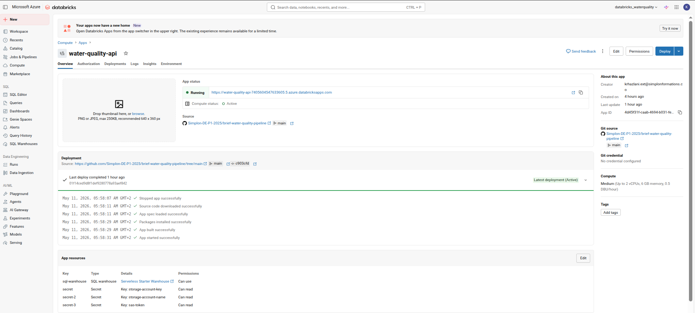

```
App     : water-quality-api
URL     : https://water-quality-api-7405604547633605.azuredatabricks.net
Source  : GitHub — Simplon-DE-P1-2025/brief-water-quality-pipeline (main)
Command : uvicorn notebooks.api.main:app --host 0.0.0.0 --port 8000
```

### 10.2 Détection d'environnement automatique

L'API détecte son contexte d'exécution pour trouver le bon `config.yaml` :

```python
def load_config(config_path=None):
    if os.path.exists("/app/python/source_code/config/config.yaml"):
        config_path = "..."  # Databricks Apps
    elif "DATABRICKS_RUNTIME_VERSION" in os.environ:
        config_path = "..."  # Databricks Notebook
    else:
        config_path = "config/config.yaml"  # Local
```

### 10.3 Endpoints disponibles

| Endpoint | Description |
|---|---|
| `GET /health` | Statut de l'API et configuration active |
| `GET /tables` | Liste des tables Gold disponibles |
| `GET /conformite/departements` | Taux de conformité par département et année |
| `GET /conformite/communes` | Stats qualité par commune avec coordonnées GPS |
| `GET /parametres/risques` | Top 10 paramètres non conformes |
| `GET /evolution/mensuelle` | Évolution mensuelle avec delta mois/mois |

Chaque endpoint supporte `?format=json` (défaut) et `?format=csv` pour export.

### 10.4 Lecture des données

En mode Databricks, l'API lit directement les tables Gold depuis Unity Catalog via `DatabricksSession` :

```python
from databricks.connect import DatabricksSession
spark = DatabricksSession.builder.getOrCreate()
df = spark.read.table(f"{CATALOG}.{GOLD_SCHEMA}.{table_name}").toPandas()
```

---

## 11. Dashboard — Databricks SQL

### 11.1 Présentation

Un dashboard interactif **"Water Quality Analysis - France"** est disponible dans Databricks SQL. Il interroge directement les tables Gold Unity Catalog.

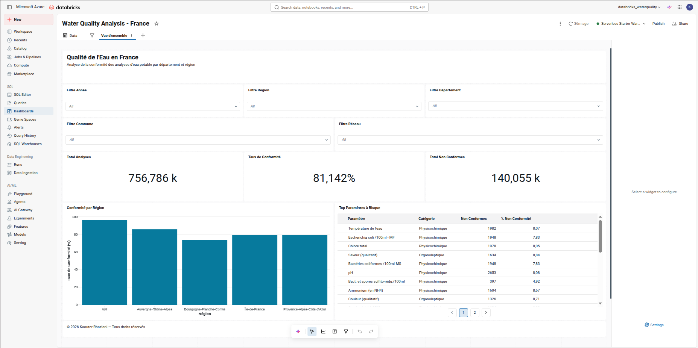

### 11.2 KPIs principaux

| Indicateur | Valeur |
|---|---|
| **Total Analyses** | 756 786 k |
| **Taux de Conformité global** | 81,14 % |
| **Total Non Conformes** | 140 055 k |

### 11.3 Filtres interactifs

5 filtres croisés permettent de segmenter les données en temps réel : Année, Région, Département, Commune, Réseau.

### 11.4 Visualisations

**Conformité par Région** — graphique en barres affichant le taux de conformité par région française.

**Top Paramètres à Risque** — tableau classé des paramètres présentant le plus grand nombre de non-conformités :

| Paramètre | Catégorie | Non Conformes | % Non Conformité |
|---|---|---|---|
| Température de l'eau | Physicochimique | 1 982 | 8,07 % |
| Escherichia coli /100ml-MF | Physicochimique | 1 948 | 7,83 % |
| Chlore total | Physicochimique | 1 978 | 8,05 % |
| pH | Physicochimique | 2 653 | 8,08 % |
| Ammonium (en NH4) | Physicochimique | 1 604 | 8,67 % |

---

## 12. Orchestration — Databricks Workflow

### 12.1 Configuration du job

```
Job     : water-quality-pipeline
Trigger : Lundi 06:00 AM Europe/Paris
Compute : Serverless
```

### 12.2 Graphe des tâches

Les deux ingestions bronze s'exécutent **en parallèle**, puis les couches suivantes démarrent séquentiellement :

```
bronze_hubeau ──┐
                ├──> silver_transform ──> gold_transform ──> data_quality
bronze_geo    ──┘
```

| Tâche | Notebook | Dépendances |
|---|---|---|
| `bronze_hubeau` | `notebooks/bronze/bronze_ingest_hubeau` | — |
| `bronze_geo` | `notebooks/bronze/bronze_ingest_geo` | — |
| `silver_transform` | `notebooks/silver/silver_transform` | bronze_hubeau, bronze_geo |
| `gold_transform` | `notebooks/gold/gold_transform` | silver_transform |
| `data_quality` | `notebooks/quality/data_quality_check` | gold_transform |

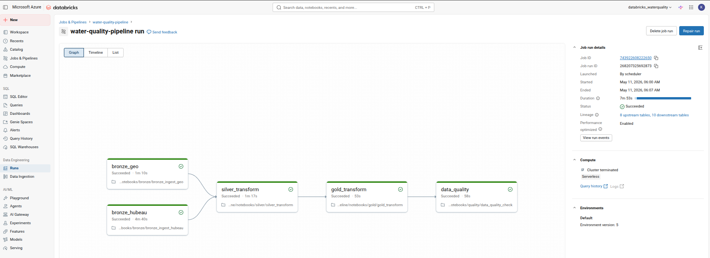

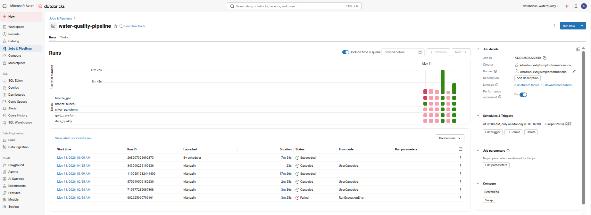

---

## 13. CI/CD — GitHub Actions

### 13.1 Pipeline CI

```
push / PR  →  Lint (flake8)  →  Tests (pytest)  →  ✅ / ❌
```

```yaml
flake8 notebooks/ config/ tests/ --max-line-length=120
pytest tests/ -v -m "not spark"
```

Les tests Spark sont marqués `@pytest.mark.spark` et exclus du CI pour éviter la dépendance à un environnement JVM complet.

### 13.2 Couverture des tests

| Fichier | Scope | Nb tests |
|---|---|---|
| `tests/test_bronze.py` | Ingestion, pagination, préparation records | 15 |
| `tests/test_silver.py` | clean, standardize, enrich_*, conformité | 60 |
| `tests/test_gold.py` | build_*, write_gold, config, chemins | 40 |

---

## 14. Tests et validation

- **Bronze** : tests sur la génération des départements, la pagination, la préparation des records, sans appel API réel.
- **Silver** : 60 tests couvrant le nettoyage, la standardisation, l'enrichissement géographique, la catégorisation, la conformité normalisée.
- **Gold** : 40 tests sur l'agrégation, le calcul du top paramètres, les stats par commune, l'évolution mensuelle.
- **Quality** : 5 suites Great Expectations sur Silver et Gold.

Les tests Spark sont isolés avec `@pytest.mark.spark` et exclus du CI pour éviter la dépendance JVM.

---

## 15. Structure du projet

```
brief-water-quality-pipeline/
├── app.yml                          # Commande Databricks Apps
├── config/
│   └── config.yaml                  # Configuration centralisée
├── notebooks/
│   ├── bronze/
│   │   ├── bronze_ingest_hubeau.py  # Ingestion Hub'Eau + pagination
│   │   └── bronze_ingest_geo.py     # Ingestion geo.api.gouv.fr
│   ├── silver/
│   │   └── silver_transform.py      # Nettoyage + enrichissement + conformité
│   ├── gold/
│   │   └── gold_transform.py        # 4 tables analytiques
│   ├── quality/
│   │   └── data_quality_check.py    # Great Expectations — 5 suites
│   └── api/
│       └── main.py                  # FastAPI — Databricks Apps
├── tests/
│   ├── conftest.py
│   ├── test_bronze.py
│   ├── test_silver.py
│   └── test_gold.py
├── .github/workflows/ci.yml
├── pyproject.toml
└── uv.lock
```

---

## 16. Données clés

| Métrique | Valeur |
|---|---|
| Source | Hub'Eau / Ministère des Solidarités et de la Santé |
| Période couverte | 2016 → 2026 |
| Lignes Bronze `water_quality` | ~757 000+ |
| Lignes Silver après nettoyage | ~756 786 |
| Colonnes Silver finales | 35 |
| Tables Gold produites | 4 |
| Suites Great Expectations | 5 (59 règles au total) |
| Tâches Workflow Databricks | 5 |
| Endpoints API | 6 |
| Licence source | Licence Ouverte / Open Licence 2.0 |

---

## 17. Limitations et axes d'amélioration

| Limitation | Axe d'amélioration |
|---|---|
| Blocages RBAC Azure (subscription formation) | Role assignment `Storage Blob Data Contributor` par un admin |
| Écriture ADLS via clé (contournement) | Écriture Spark native via Access Connector dès RBAC accordé |
| CD non mis en place | Pipeline de déploiement Databricks via API dès accès rétabli |
| Pipeline validé sur 3 départements | Extensible France entière dès accès cloud complets |
| API sans authentification avancée | Ajout OAuth2 / token Databricks |
| Dashboard non publié | Publication via Databricks dès accès complets |

---

## 18. Synthèse

Ce projet démontre la construction d'un pipeline analytique moderne sur la qualité de l'eau potable, de l'ingestion brute à l'exposition API, en passant par la validation qualité et l'orchestration cloud.

L'architecture médaillon en 5 couches (Bronze → Silver → Gold → Quality → API), le dual-write Unity Catalog + ADLS Gen2, le Workflow Databricks hebdomadaire, le dashboard SQL interactif et l'API FastAPI Databricks Apps constituent un système de bout en bout opérationnel.

Malgré les contraintes d'accès Azure de la subscription de formation, les contournements techniques mis en place — authentification par clé, Serverless Compute, Databricks Secrets — ont permis de livrer un pipeline fonctionnel, testé et documenté.